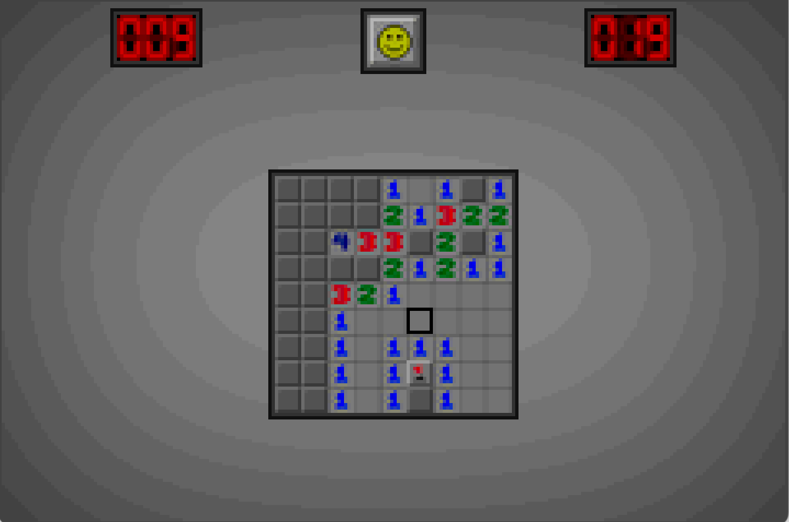
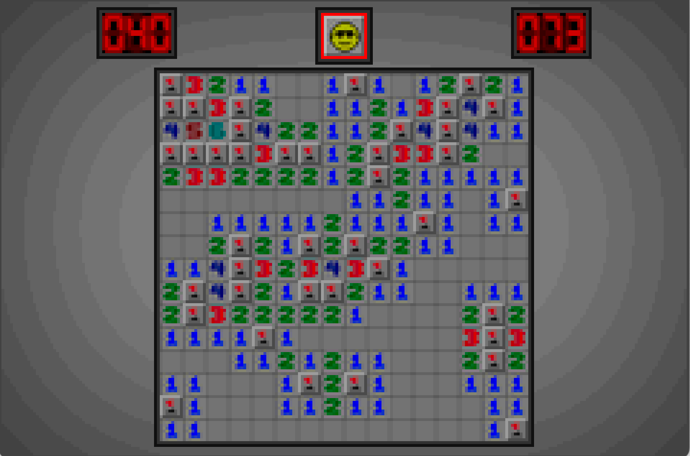
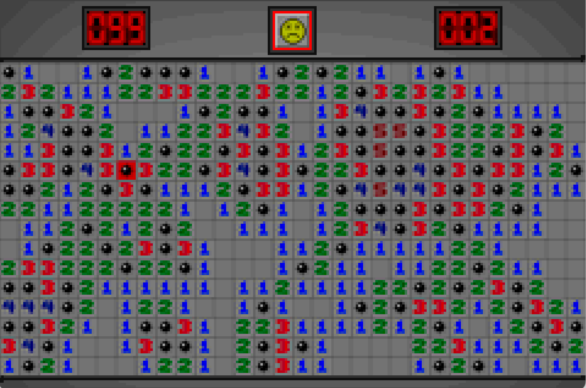

# GBA Minesweeper

Player minesweeper on your Game Boy Advanced. With beginner, intermediate, and expert difficulties, as well as highscores.

You can download the ROM from the [release section](https://github.com/SheepWizard/gba-minesweeper/releases/tag/1.0.0).

[Youtube video](https://www.youtube.com/watch?v=yNUGPNMnJJQ)

## Images

## Controls
|Control| Action |
|--|--|
| A | Open cell |
| B | Flag cell |
| L | Chord |
| R | Chord |
| Dpad | Move selector |
| Select | Restart game |
| Start | Go back to menu |

## Build

First create asset files (requires [Grit](https://www.coranac.com/man/grit/html/grit.htm)):

`sh make_assets.sh`

Run make, requires [devkitpro](https://devkitpro.org/wiki/Getting_Started) and [tonc](https://gbadev.net/tonc/) (comes with devkitpro):

`make -f Makefile`

This will make your a `gba` file that you can run on a emulator.

